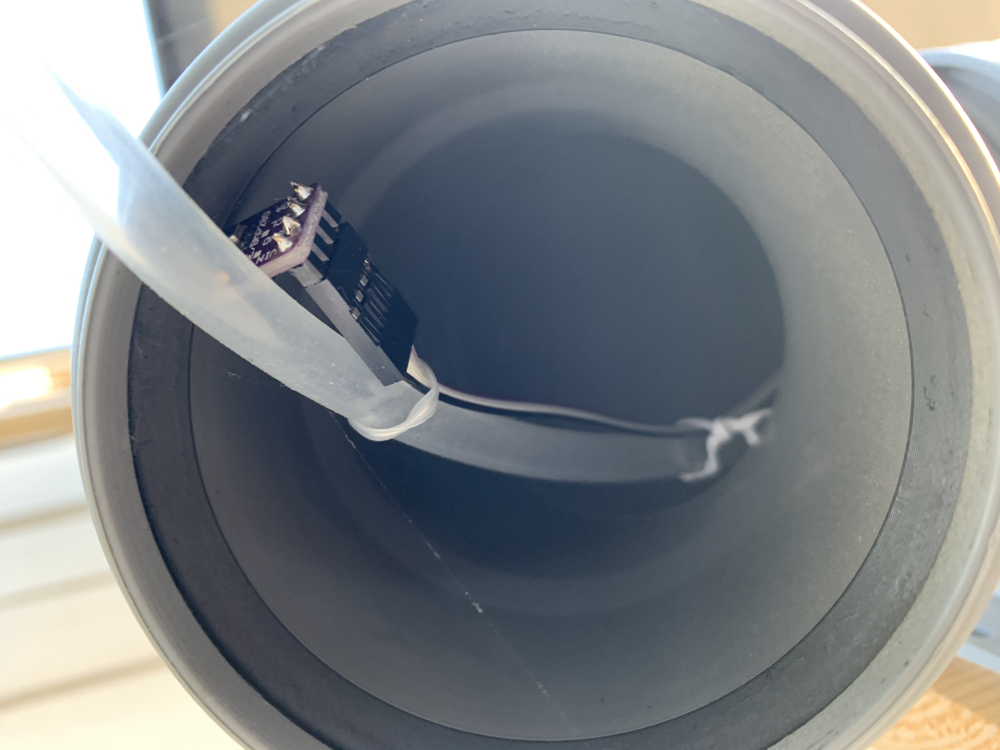

# weather-station
I wanted to experiment with building environmental sensors, and see if I could make homemade electronics that would survive in the outdoors. So I built a weather station based around the Arduino-compatible ESP8266 platform.

 
<i>Weather station at work, in a light breeze. Most of the fun stuff is hidden inside that grey pipe.</i>

## Overview
There are many possible instruments that can be part of a weather station. For the amateur meteorologist, just a few are needed to make a start. They can all be bought cheaply online, and a weatherproof case can be made out of just a few short lengths of PVC piping. Credit to https://sensor.community for inspiration here - I based the system on this [reference design](https://sensor.community/en/sensors/airrohr/), with some additions for the extra sensors I wanted. The software is custom-made. See the [references](#references) section at the end for many useful links on how to build something similar yourself.

With this system we can measure:
 * Wind speed
 * Temperature
 * [Relative humidity](https://en.wikipedia.org/wiki/Relative_humidity)
 * [Air pressure](https://en.wikipedia.org/wiki/Atmospheric_pressure)
 * Air [particulate](https://en.wikipedia.org/wiki/Particulates) matter (PM2.5 and PM10)
 * Solar U.V. [intensity](https://en.wikipedia.org/wiki/Ultraviolet_index) - we can estimate the U.V. index
 * Rainfall (sort-of)
 
This is a wall-mounted device so wind direction wasn't really something I cared about for this project.

## Materials required

Sensors and electronics:

* [BME280](https://www.amazon.de/-/en/gp/product/B07D8T4HP6/ref=ppx_yo_dt_b_search_asin_title?ie=UTF8&psc=1) - Temperature, Humidity, and Air Pressure sensor
* [SDS011](https://www.amazon.de/-/en/gp/product/B07911ZY9W/ref=ppx_yo_dt_b_search_asin_title?ie=UTF8&psc=1) - Air particulate matter sensor (PM2.5 and PM10)
* [MH-RD](https://www.amazon.de/-/en/AZDelivery-Rain-Sensor-Module-Parent/dp/B07V5QQW9J/ref=sr_1_9?dchild=1&keywords=arduino%2Bregensensor&qid=1588014518&sr=8-9&th=1) - Rainfall droplet sensor
* [Froggit](https://www.amazon.de/-/en/gp/product/B00GGM5HEA/ref=ppx_yo_dt_b_search_asin_title?ie=UTF8&psc=1) - Anemometer
* [GY-8511](https://www.amazon.de/-/en/gp/product/B07PQPHJKR/ref=ppx_yo_dt_b_asin_title_o01_s00?ie=UTF8&psc=1) - Ultraviolet intensity sensor
* [NodeMCU ESP8266](https://www.amazon.de/-/en/gp/product/B074Q2WM1Y/ref=ppx_yo_dt_b_search_asin_title?ie=UTF8&psc=1) - Arduino-compatible microcontroller
* [JST headers](https://www.amazon.de/YIXISI-Connector-JST-XH-Female-Adapter/dp/B082ZLYRRN/ref=sr_1_1_sspa?dchild=1&keywords=jst+kit&qid=1605108398&sr=8-1-spons&psc=1&spLa=ZW5jcnlwdGVkUXVhbGlmaWVyPUFITU9OODc2TFg4MzEmZW5jcnlwdGVkSWQ9QTAxNTU4NzMyOVdJRFVETUhCV1Y3JmVuY3J5cHRlZEFkSWQ9QTAwODA5ODVQWFZCU00yNTJBSlYmd2lkZ2V0TmFtZT1zcF9hdGYmYWN0aW9uPWNsaWNrUmVkaXJlY3QmZG9Ob3RMb2dDbGljaz10cnVl)
* Digital/Analogue [multiplexer](https://www.amazon.de/-/en/gp/product/B06Y1L95GK/ref=ppx_yo_dt_b_search_asin_title?ie=UTF8&psc=1)
* 10kΩ [resistor](https://www.amazon.de/-/en/gp/product/B07Q87JZ9G/ref=ppx_yo_dt_b_search_asin_title?ie=UTF8&psc=1)
* [Ribbon cable](https://www.amazon.de/-/en/gp/product/B076CLY8NH/ref=ppx_yo_dt_b_search_asin_title?ie=UTF8&psc=1)
* [Perfboard](https://www.amazon.de/-/en/gp/product/B07BDKG68Q/ref=ppx_yo_dt_b_search_asin_title?ie=UTF8&psc=1)
* USB power supply

Case construction:

* 2x [45-degree drainpipe elbow](https://www.obi.de/ht-boegen/marley-ht-bogen-45-dn-75-grau/p/7436181)
* [Drainpipe with "cleaning" cap](https://www.obi.de/ht-reinigungsrohre/marley-ht-reinigungsrohr-dn-75/p/7434681)
* 2x [Gutter bracket](https://www.obi.de/kunststoff-dachrinnen/marley-rinnenhalter-verstellbar-dn-75-grau/p/5088869)
* [PTFE tape](https://www.amazon.de/-/en/Pack-Sealing-Thread-Teflon-White/dp/B071X6PC89/ref=sr_1_5?dchild=1&keywords=ptfe+tape&qid=1605696229&sr=8-5) for sealing joints
* Wooden board for mounting as required
* Rubber tube for air intake
* Insulating plastic/foam liner

UV Sensor module:
* Some little [wooden boards](https://www.amazon.de/-/en/gp/product/B07D76MKFY/ref=ppx_yo_dt_b_search_asin_title?ie=UTF8&psc=1)
* Small glass dome / [clock glass](https://www.amazon.de/-/en/gp/product/B00FWSFHBW/ref=ppx_yo_dt_b_asin_title_o04_s00?ie=UTF8&psc=1)
* Weather-resistant cabling
* Waterproof rubber gasket

## Circuit
The NodeMCU connects directly to the digital devices, and uses a multiplexer to read from the analog output devices. This diagram represents the anemometer as a "motor" - it generates signal pulses as it rotates on an axis.

 
 <i>Circuit overview - export from fritzing <a href="weather-station.fzz">file</a></i>

The perfboard assembly was a little tricky because everything had to fit into a narrow package, and also be screwed on to the air quality board mounted directly underneath. This diagram shows how the two fit together. Those black squares on the perfboard show areas where holes were drilled to join the two together.

 
 <i>Perfboard and external components - export from fritzing <a href="weather-station-board.fzz">file</a></i>

The UV sensor is itself mounted on a small perfboard, which terminates the connection from the main case (It's mounted about 5m away and connected over Cat5 cable)

 
 <i>UV sensor mini board - export from fritzing <a href="uv_sensor_mini_board.fzz">file</a></i>

## Assembly

First step was to make sure all the components were working together. I had tested them [individually](/testing) beforehand. Here they're all mounted on a breadboard with external components wired in too.

Next step was soldering the perfboard and mounting the multiplexer, NodeMCU and wiring. Followed by mounting the air quality sensor underneath - with a layer of plastic and foam in between to prevent any short-circuits between exposed pins on the two devices.

And sliding the complete unit into the case:

It's a tight fit!

For the external UV sensor, I made a flat mount on a piece of board and painted it white, to keep moisture out and keep it cool in the sunshine. The UV sensor is protected from moisture by:
 * A white cap from a jar of skin cream
 * A rubber gasket from a coffee mokka
 * An inverted clock glass (with relatively high UV-transmissivity)
 * Some plastic chair leg-ends to clamp it together with some flexibility
 

### Mounted in place

With everything in place and tightly fit together, it was time to install it in place on the balcony. We have a drainpipe that was a convenient place to attach it, as you can see in the <a href="#introduction">introduction</a>.

 
<i>View from underneath. Holes for external connections in the middle here.</i>

 
<i>Views from the ends of either side of the main tube. Left: air intake tube and BME280 sensor. Right: rear of the SDS011 and exposed cabling.</i>

## Software
The onboard [software](weather-station.ino) runs in a continuous loop. It simply captures the data, packages the results in a JSON blob, and sends them to a logging server on the local LAN. In case of any errors connecting to WiFi or to this server, it does a hard reboot. This is sufficient since the data is not time-critical, and up-to-date data is less important than an hourly/daily trend.

## Data Capture and Visualisation

** todo grafana, server, data format, etc **

## Performance over time
It survived its first summer with months of direct sunlight and internal temperatures up to 37°C. Will it survive its first winter, with ice and snow? Time will tell...

As of November 2020 it's been outside for over 6 months and still works, data seems consistent and matches what I see from the official weather reports. The only component that has significantly degraded is the rainfall sensor, which gives junk results now. Constant rainfall has eroded the resistive surface and left some kind of rust all over it. This should be replaced.

## Future enhancements

Rainfall sensor:
 * Replace with a better device that will not degrade so much over time. A capacitive option might be a good alternative with no moving parts.
 
Remove multiplexer:
 * I think I had some issues with analogue data reads the first time around, but it appears that the multiplexer board isn't actually required. I would remove this next time and connect external devices directly to the NodeMCU board.
 
Submit data online:
 * I would like to submit the recorded data from my server to https://luftdaten.info/, https://www.pwsweather.com/ or similar

Data validation:
 * The onboard software does no sanity checking of the data it reports back to the server. On at least one occasion this meant it reported a temperature of -143°C which was fixed by a hard reboot.
 * The software should include some hardcoded bounds outside which it will report an error status back to the server.

Case construction:
 * The anemometer is mounted into a hole drilled in the pipe cleaning cap. Next time I would rather mount the anemometer into a bracket that clips on top of that cap. Having a hole that has to be sealed with PTFE, right above the electronics, is likely to eventually fail due to water accumulation.
 * All the external connectors (USB power in, rainfall sensor, UV sensor, and anemometer cable) are routed through holes drilled in the bottom of the case. This doesn't look great, and makes it awkward/imposssible to disconnect them without disassembling the whole thing.
 * I would like to build a small "[patch panel](https://en.wikipedia.org/wiki/Patch_panel)" with JST connectors for all the external connections, that would be flat-mounted on the bottom of the case. A single USB connection for power/data would also be located here, so everything could be disconnected as needed without needing to open the whole thing up.

Air intake tube mount:
 * A 3D-printed mount for the air intake tube, [like this one](https://www.thingiverse.com/thing:3945004), would make the case look nicer and more professionally finished.

## References
* https://hackaday.io/project/165061-solar-powered-wifi-weather-station-v20#j-discussions-title - A solar-powered weather station combining several of the same sensors used here.
* https://www.geeky-gadgets.com/arduino-wind-speed-meter-anemometer-project-30032016/ - Converting an anemometer's analogue readings into a digital signal for wind speed
* https://learn.sparkfun.com/tutorials/ml8511-uv-sensor-hookup-guide/all - Using a UV intensity sensor
* https://gist.github.com/geoffwatts/b0b488b5a5257223ed53 - Using a PM2.5 air particulate sensor
* https://sensor.community/en/sensors/ - Reference designs for weather stations which I used as inspiration for this project
* https://sensor.community/en/sensors/airrohr/ - The specific example I based this project on
* https://learn.pimoroni.com/tutorial/sandyj/enviro-plus-and-luftdaten-air-quality-station - A similar project although based around the Raspberry Pi Zero platform
* https://www.aeq-web.com/anemometer-mit-dem-arduino-bauen/ - Reading from an anemometer using an Arduino Uno
* https://forum.arduino.cc/index.php?topic=616264.0 - Handling interrupts on a NodeMCU board
* https://github.com/Naesstrom/Airrohr-kit - A similar project using a PCB
